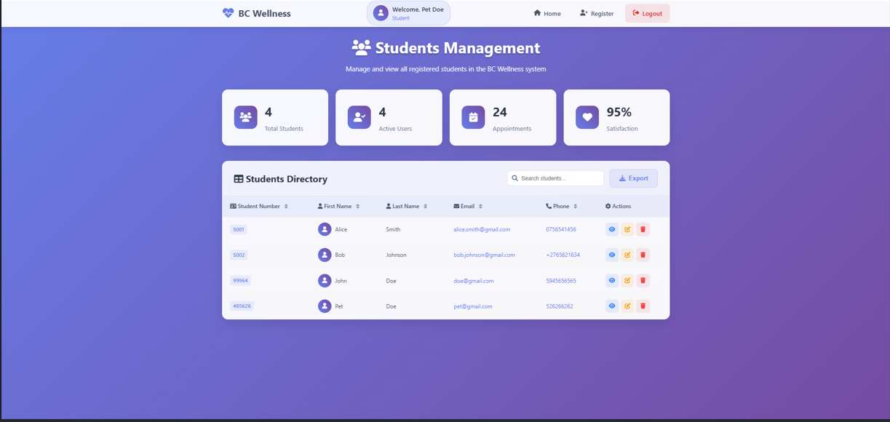
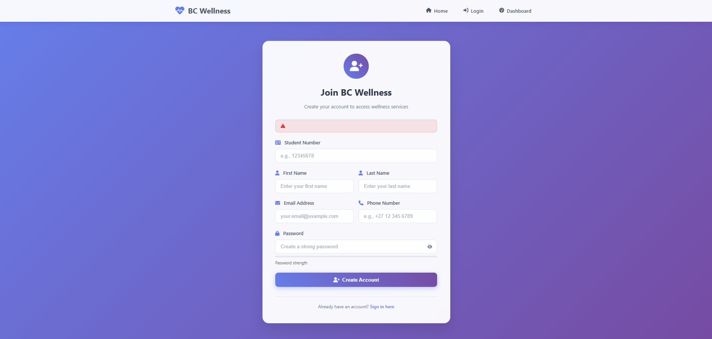

# BC Student Wellness Management System

> An integrated wellness management platform for students, combining a secure web-based authentication system with a robust desktop application for managing appointments, counselors, and student feedback.


---

### 🧭 Overview

The **BC Student Wellness Management System** is a comprehensive two-tier application developed to enhance student wellness services at Belgium Campus. It offers a seamless experience for students to access counseling services and enables administrative staff to manage those services efficiently.

The platform is divided into:

* 🌐 A **JSP-based web portal** for student login and registration, backed by a PostgreSQL database.
* 🖥️ A **Java Swing desktop application** for managing wellness services including appointments, counselors, and feedback, utilizing JavaDB for local storage.

This project demonstrates:

* Core Java & Object-Oriented Programming (OOP)
* GUI development using Java Swing
* Web technologies with JSP and Servlets
* Integration with PostgreSQL and JavaDB
* MVC architectural pattern for clean separation of concerns
* Emphasis on security and data validation

---

## 🚀 Features

### 🌐 Web Module (JSP + PostgreSQL)

* 📝 Student registration with full validation and secure password storage
* 🔐 Login system with session handling and access control
* 🎯 Personalized dashboard with logout functionality

### 🖥️ Desktop Module (Swing + JavaDB)

* 📅 Appointment booking, editing, cancellation
* 👩‍⚕️ CRUD operations for counselor profiles
* 💬 Feedback collection and management with ratings

---

## 📸 Screenshots

### 🏠 Home Page



### 🧾 Register Page



### 📅 Appointment Booking


---

## 🛠️ Installation

### Web Application (JSP + PostgreSQL)

```bash
# Clone the repository
git clone https://github.com/tshepangkagiso/BC-Student-Wellness-Management-System.git

# Navigate to the web app directory
cd BC-Student-Wellness-Management-System/webapp

# Setup PostgreSQL:
# 1. Create a database and run `postgres_schema.sql`
# 2. Update database credentials in servlet files

# Deploy using Apache Tomcat
```

### Desktop Application (Swing + JavaDB)

```bash
# Open the project in your preferred Java IDE (IntelliJ, NetBeans, etc.)
# Ensure JavaDB (Derby) is configured properly
# Run database initialization script: `javadb_init.sql`
# Launch the application from `desktop/gui/Main.java`
```

---

## 📦 Usage

### Web Module

* Open `http://localhost:8080/wellness-system/` in your browser
* Register or log in to access the student dashboard

### Desktop Module

* Use the application GUI to:

  * Book and manage appointments
  * Add, update, or remove counselors
  * Submit and view student feedback

---

## 🧪 Testing

* Perform manual testing through the web forms and desktop GUI
* Verify database transactions via PostgreSQL and JavaDB tools
* Review logs and handle exceptions via terminal or IDE console

---

## 🧱 Built With

* 💻 Java (Core + Swing)
* 🌐 JSP & Servlets
* 🗃️ PostgreSQL (Web backend)
* 🗂️ JavaDB / Apache Derby (Desktop backend)
* 🧰 MVC Architecture
* 🔒 SHA-256 password hashing

---

## 🧑‍💻 Contributing

Contributions are welcome!

1. Fork the repository
2. Create a new branch: `git checkout -b feature/your-feature`
3. Commit your changes: `git commit -m "Add new feature"`
4. Push the branch: `git push origin feature/your-feature`
5. Submit a pull request

---

## 🪪 License

Distributed under the MIT License. See the [`LICENSE`](./LICENSE) file for details.

---

## 🙋‍♂️ Contact

**Belgium Campus Student Team**
**Author**: Tshepang Kagiso Mashigo
**Project Repository**: [GitHub](https://github.com/tshepangkagiso/BC-Student-Wellness-Management-System.git)

---

> © 2025 Tshepang Kagiso Mashigo – All rights reserved.

---
