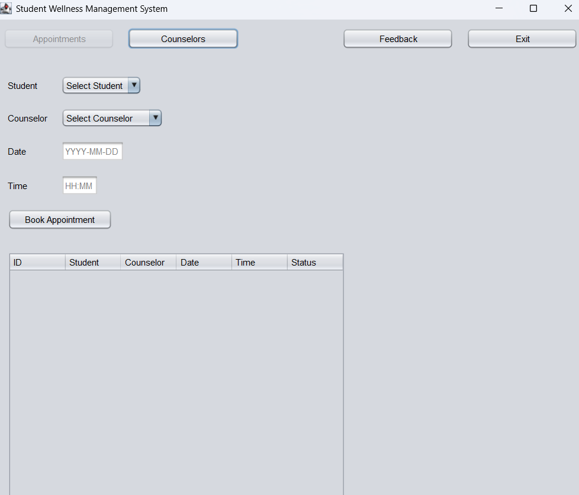

# BC Student Wellness Management System

> A two-part student wellness management solution using JSP for web login/registration and Java Swing for desktop management of wellness services.


---

## 🚀 Features

### 🌐 Web Module (JSP + PostgreSQL)

* 📝 Student registration with form validation and password hashing
* 🔐 Secure login with session management
* 🎯 Personalized dashboard and logout functionality

### 🖥️ Desktop Module (Swing + JavaDB)

* 📅 Appointment booking and management
* 👩‍⚕️ Counselor management (add/edit/remove)
* 💬 Student feedback system with ratings

---

## 📸 Screenshots

## 📸 Screenshots

### 🏠 Home Page


### 🔐 Login Page


### 📅 Appointment Booking



## 🛠️ Installation

### Web App Setup (JSP + PostgreSQL)

```bash
# Clone the repo
git clone https://github.com/yourusername/wellness-system.git

# Navigate to the web app directory
cd wellness-system/webapp

# Setup PostgreSQL:
# 1. Create database and run `postgres_schema.sql`
# 2. Update DB credentials in servlet files

# Deploy using Apache Tomcat
```

### Desktop App Setup (Swing + JavaDB)

```bash
# Open the project in your IDE (e.g., IntelliJ, NetBeans)
# Configure JavaDB (Derby) and ensure tables are initialized using `javadb_init.sql`
# Run the main class from `desktop/gui/Main.java`
```

---

## 📦 Usage

### Web Module

* Visit `http://localhost:8080/wellness-system/`
* Register or login to access services

### Desktop Module

* Navigate through tabs:

  * Appointments
  * Counselors
  * Feedback
* Perform CRUD operations through the GUI

---

## 🧪 Running Tests

* Manual testing via UI (JSP forms, Swing forms)
* Validate DB actions via PostgreSQL and JavaDB consoles
* Exception logs printed in terminal/IDE console

---

## 🧱 Built With

* 💻 Java (Core + Swing)
* 🌐 JSP & Servlets
* 🗃️ PostgreSQL (Web)
* 🗂️ JavaDB / Derby (Desktop)
* 🧰 MVC Architecture
* 🔒 Secure password hashing (e.g., SHA-256)

---

## 🧑‍💻 Contributing

We welcome contributions!

1. Fork this repo
2. Create a new branch: `git checkout -b feature-name`
3. Make your changes and commit: `git commit -m 'Add new feature'`
4. Push to the branch: `git push origin feature-name`
5. Open a Pull Request

---

## 🪪 License

Distributed under the MIT License. See `LICENSE` for more information.

---

## 🙋‍♂️ Contact

Belgium Campus Student Team
Email: [student@example.com](mailto:student@example.com)
Project Link: [https://github.com/yourusername/wellness-system](https://github.com/yourusername/wellness-system)

---

> © 2025 Belgium Campus – Built with ❤️ by Students

---
